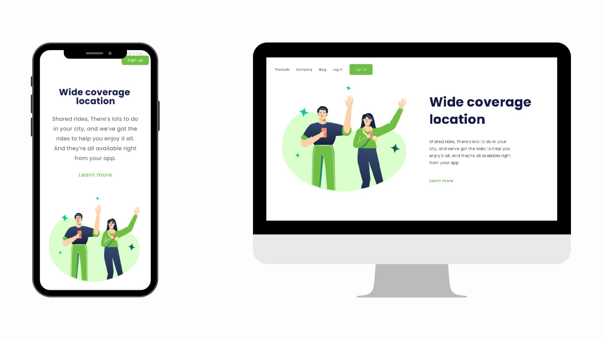

[We are ONLINE, try Now](https://use-origin.netlify.app/) :tada: 

<h3 align="center">
  Wide coverage location
</h3>

<h3 align="left">
  Esse foi um projeto que eu aprendi no <a href="https://rodolfomori.com.br/devclub/">DevClub</a>
</h3>

 

  <a href="#house-about-the-project">About the project</a>&nbsp;&nbsp;&nbsp;|&nbsp;&nbsp;&nbsp;
  <a href="#computer-technologies">Technologies</a>&nbsp;&nbsp;&nbsp;|&nbsp;&nbsp;&nbsp;
  <a href="#construction_worker-installation">Getting started</a>&nbsp;&nbsp;&nbsp;

 

 

## :house: About the project

A simple landing page with a navigation bar
 

 

## 💻 Technologies

- 
- 

Made with ♥ by Rodolfo Mori :wave: [Get in touch!](https://www.linkedin.com/in//)
t
